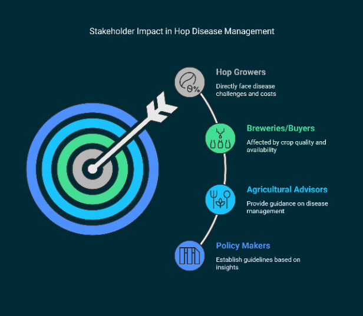
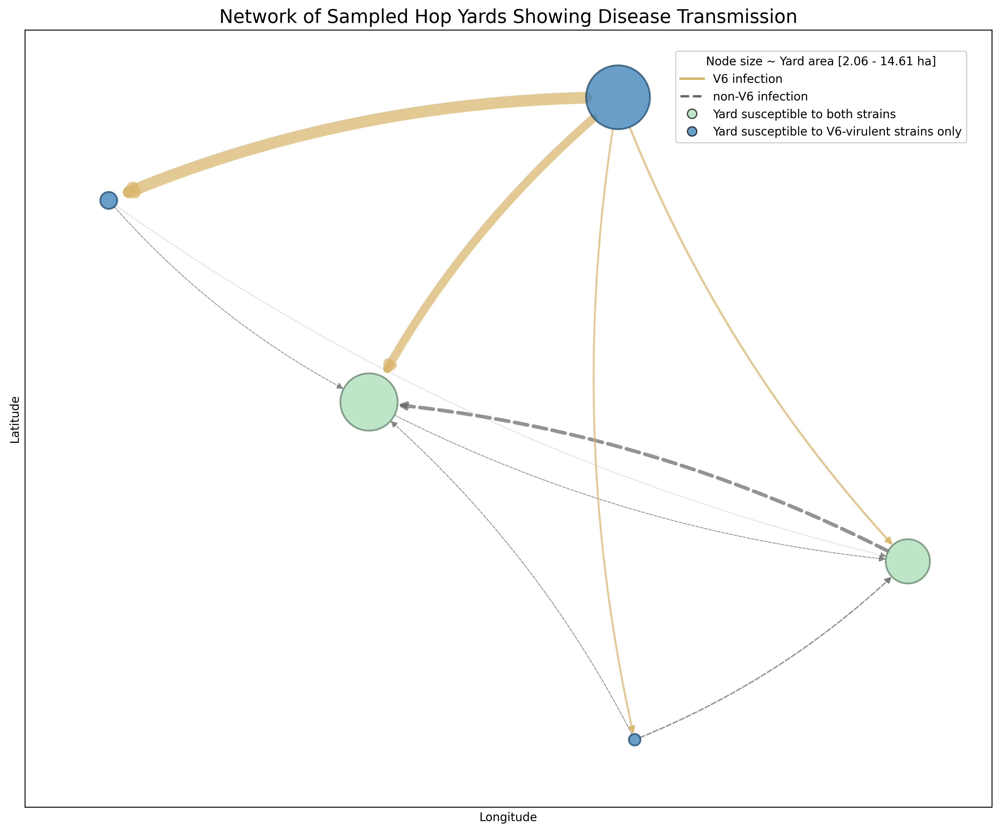

# Inoculum Dose, Diversity, Dispersal, and Damage: Simulating Optimal Economic Control of an Aerially-Dispersed Plant Pathogen

**Authors:**
- Joshua F. Pedro (Department of Mathematics, City University of New York, NY 10031)
- Sharmodeep Bhattacharyya (Department of Statistics, Oregon State University, Corvallis, OR 97331)
- Shirshendu Chatterjee (Department of Mathematics, City University of New York, NY 10031)
- Thomas L. Marsh (School of Economic Sciences, Washington State University, Pullman, WA 99163)
- Jae Young Hwang (U.S. Department of Agriculture-Agricultural Research Service, Forage Seed and Cereal Research Unit, Corvallis, OR 97331)
- David H. Gent* (U.S. Department of Agriculture-Agricultural Research Service, Forage Seed and Cereal Research Unit, Corvallis, OR 97331)

*Corresponding author: David H. Gent (dave.gent@usda.gov)

## Abstract

# CONTEXT
Plant pathogens that disperse by airborne propagules may cause damage that extends beyond the borders of individual fields. Developing sound management strategies, therefore, requires consideration of heterogeneity in pathogen transmission, the effectiveness of control measures, host susceptibility and pathogen virulence, and the resulting economic outcomes that scale up at the regional level with coordinated management. 
#OBJECTIVE
We use hop powdery mildew as a motivating pathosystem to develop a coupled epidemiological-economic model to enable simulation of the impact of epidemic conditions and coordinated management interventions on profitability. This pathosystem is a well-suited case study because disease development may be limited by primary inoculum and fungicide applications, yet the pathogen can spread via long-distance dispersal between fields and rapidly damage both crop yield and quality. 
#METHODS
We parameterized the model using data collected from a census sample of commercial hop yards in Oregon during 2014 to 2017, including the monthly incidence of plants with powdery mildew, fungicides applied by growers, and estimated revenue depending on how the incidence of diseased hop cones affects yield and the likelihood of crop devaluation. We show that conditions in the early stages of epidemics related to primary inoculum dose, pathogen diversity, and the intensity of management intervention interact and determine the optimal regional control strategy. 
#RESULTS AND CONCLUSIONS
As the likelihood of primary infection increases, due to either the dose of primary inoculum or virulence of the pathogen population, mean profitability decreases. These effects are most pronounced when primary infection occurs in the yards that are most central in the disesae transmission network. The choice of how many fungicide applications to make in response to initial infection has little effect on profitability when the primary inoculum is relatively infrequent. However, as primary inoculum increases, targeted fungicide applications made in the early stages of epidemics are essential for maximizing profitability region-wide. These principles hold across a range of market demand scenarios that change crop quality standards, even though relative profit losses increase under low demand conditions. 
#SIGNIFICANCE
Our analysis addresses a multifaceted challenge in agricultural disease management where epidemic control decisions must account for interactions between pathogen biology, management practices, market conditions, and regional-scale disease transmission. This research provides a framework for formally understanding factors that influence the cost of disease in complex agricultural systems where pathogens disperse across management units.

**Keywords**: plant disease, pathogens, epidemiology, economic impacts, disease management, landscape-scale

## Table of Contents

1. [Introduction](#introduction)
2. [Material and Methods](#material-and-methods)
   - [Study System](#study-system)
   - [Biological Data Acquisition](#biological-data-acquisition)
   - [Pesticide Use and Costs](#pesticide-use-and-costs)
   - [General Modeling Approach](#general-modeling-approach)
   - [Submodels](#submodels)
3. [Simulation Experiments](#simulation-experiments)
4. [Results](#results)
5. [Discussion](#discussion)
6. [Appendix](#appendix)
7. [Acknowledgements](#acknowledgements)

---

## Introduction

**Figure 1: Stakeholder impact network of disease management in the motivating hop powdery mildew pathosystem.** This diagram depicts the interconnected relationships among key stakeholders affected by disease management decisions, including hop growers (who directly face disease challenges and costs), breweries/buyers (affected by crop quality and availability), agricultural advisors (who provide guidance on disease management), and policy makers (who establish guidelines based on research insights).

**Figure 2: Conceptual framework for disease management in the motivating pathosystem.** This funnel diagram illustrates the multi-stage decision-making process in disease management, showing the sequential evaluation of pathogen diversity assessment, disease spread dynamics, fungicide application decisions, and economic impact evaluation. Each stage represents a key component of the integrated epidemiological-economic model developed in this study.

There is increasing scrutiny of pesticides in agriculture and a need to develop management strategies and policies that reduce inputs while maintaining productivity and profitability [[1]](#Pimentel2005) [[2]](#Waard1993). Disease management efforts are most often directed at the scale of individual fields or farms, but plant pathogens do not respect management units or jurisdictional boundaries [[3]](#Gilligan2008). Management may be suboptimal or ineffective when not properly matched to the scale of pathogen dispersal [[4]](#Gilligan2007). The relative importance of inoculum produced endogenously within a given field or exogenously in other locations may dictate the mitigation strategies and the need for collective action in the form of area-wide management [[5]](#Irwin1999).

Foundational theory in plant disease epidemiology suggests that mitigation efforts that reduce primary inoculum only delay epidemics, with the effect being inversely proportional to epidemic velocity [[11]](#Plank1963). Yet, a number of empirical studies and modeling suggest that early intervention is critical for containing the spread of disease outbreaks [[12]](#Cunniffe2015b) [[13]](#Fraser2004). Epidemics caused by pathogens capable of long-distance dispersal appear sensitive to the conditions in the initial outbreak area [[14]](#Severns2022) [[15]](#Estep2014). Final epidemic severity may depend on the size of the initial focus, pattern of initial inoculum, proportion of susceptible hosts in the population, and connectivity to other susceptible hosts [[16]](#Ojiambo2017) [[17]](#Severns2014). The importance of these factors may depend sensitively on parameters controlling pathogen transmission and stochasticity in the earliest stages of an epidemic [[18]](#Xu1998). Concrete recommendations for control strategies also depend on the relative effectiveness and costs of controls [[19]](#Margosian2009).

The need for modeling to explicitly express processes and current understanding of a system is clear [[20]](#Pautasso2010) [[23]](#Lofgren2014), yet linking epidemiological models to crop damage and economic outcomes when pathogens potentially disperse over long distances is a challenging problem [[24]](#Cunniffe2015). The motivating pathosystem for the research we present, hop powdery mildew, engenders many of these challenging aspects. The disease is caused by the fungus *Podosphaera macularis* and remains one of the most difficult and costly problems affecting hop producers in the western U.S. and other production regions. Success in breeding cultivars resistant to the disease has been met by the emergence of strains of the fungus that can overcome host resistance when the said resistance is broadly deployed in the landscape. Therefore, management still relies heavily on cultural practices that reduce inoculum density and fungicides to slow the rate of disease progression.

This pathosystem has several biological and economic attributes that make it an exemplar for developing the modeling framework we propose herein, and also broadly of interest for other aerially-dispersed plant pathogens in complex social-ecological systems.

First, the causal pathogen is an obligate biotroph with a host range limited to the plant family Cannabanaceae, with hop being the dominant and most important host cultivated at the time of these studies. Consequently, it is possible to infer disease transmission between yards because other sources of inoculum are trivial. Further, this system is amenable to modeling dispersal between yards as *P. macularis* exhibits annual cycles of emergence, colonization, and extinction. The fungus persists from season to season in the Pacific Northwestern U.S. only in association with living host tissue, provisioned by infected crown buds, due to the absence of the sexual stage of the pathogen in this region. Bud infection and overwintering of the pathogen lead to highly focal infections owing to the emergence of heavily infected shoots in spring, the so-called flag shoots, which occur at a low frequency in commercial hop yards. From these focal infections, *P. macularis* disperses via wind and readily spreads within the network of hop yards to create regional epidemics. At the end of the cropping season, the pathogen becomes locally extinct in most yards due to its low overwintering survival. Thus, a new realization of the disease development and transmission process can be observed annually.

Pathogenic variation is common in pathogens across plant and animal hosts and has important implications for the dynamics of disease transmission and severity. This is especially relevant in agricultural systems where R-gene-mediated resistance is deployed and creates a mosaic of resistant and susceptible hosts. Host resistance to powdery mildew is commercially available in hop and multiple pathogenic variants (strains) exist in *P. macularis* in certain populations. As hop plants are long-lived perennials, relatively stable patterns of resistant and susceptible cultivars are present in the landscape.

The pathosystem is of further interest because powdery mildew may cause economic losses by reducing both yield and crop quality. This is a common scenario in many agricultural systems, particularly for crops marketed directly to consumers with cosmetic value. In these situations, the financial loss incurred by the grower may be linked in complex ways to market demand. Indeed, this is the situation with hops and powdery mildew because the disease may reduce brewing value and cause conspicuous visual defects from degraded cone color. For this reason, growers apply fungicides repeatedly during the season with the goal of minimizing inoculum pressure for the critical cone phase of the disease. Fungicide applications for powdery mildew may occur over a period of multiple months to minimize foliar infections in spring and then later in summer to minimize cone infection. Thus, growers must make multiple decisions on when to begin treatment and how intensively to treat.

Adding even more uncertainty, hops are sold almost entirely through marketing contracts that stipulate quality standards, usually with vague or subjective quality standards. Contracting is conducted for numerous agricultural commodities, and in 2017 21 percent of total U.S. crop production was under a contract agreement. Price risk reduction is stated as a major incentive for contracting. The potential for crop devaluation or, in the worst case, rejection, may substantially affect disease management choices since the producer assumes firstly the risk of crop damage and secondly the penalty for failing on a contractual obligation. We expect that optimal disease control strategies may therefore be sensitive to contract structure when crop value or saleability is inseparably linked to crop quality metrics. Furthermore, the optimal control strategy may depend on practices in other fields and other farms, given the potential for long-distance dispersal of the pathogen.

Motivated by this pathosystem, we draw upon an exceptionally rich data set collected from a census sample of hop yards in Oregon over a four-year period for our analyses. We formulate an epidemiological model for the development and spread of powdery mildew at the regional level, including the effect of fungicides applied in a field of interest and all other potential source fields. We couple the epidemiological model to an economic model of expected revenue and costs associated with disease management, devaluation or rejection due to quality defects, and market conditions (Figures 1 and 2). We then simulate varying conditions of the initial phases of epidemics related to primary inoculum dose, pathogen diversity, centrality in the transmission network of fields, and management intervention to identify control strategies that maximize profit under varying market demand scenarios.

---

## Material and Methods

### Study system

Our study system is the hop production region in western Oregon. Oregon is one of the leading hop producing regions in the U.S. and commercial production is concentrated in a few counties in the Willamette Valley in the western portion of the state. Hop powdery mildew was first confirmed in the field in Oregon in 1998 and has occurred annually each year since then. Historically, powdery mildew has tended to occur most regularly and most severely in production regions in the eastern extent of the Willamette Valley, presumably due to the frequency of overwintered inoculum and subsequent dispersal from the resultant disease foci [[6]](#Mahaffee2016). We intentionally focused on hop farms in the eastern production regions for data acquisition. The diversity of cultivars and production practices in this region are summarized elsewhere [[7]](#Thompson2016).

### Biological data acquisition

We obtained monthly data on the incidence of plants with powdery mildew or primary infection (i.e., occurrence of a flag shoot) from a census survey of hop yards. Disease assessments were conducted monthly from April to July during each of 2014 to 2017. For brevity, a summary of the disease assessment methods is provided here; a complete description of the methods is given in the referenced work [[8]](#Bassanezi2013). There were 8 to 10 farms sampled per year, all within Marion County, Oregon, with a maximum distance between yards of 26 km. After cleaning, data were available for 99 yards assessed in 2014, 113 in 2015, 116 in 2016, and 122 in 2017. All cultivars were evaluated, independent of their susceptibility to powdery mildew. The incidence of plants with powdery mildew was assessed using a modification of cluster sampling methods described previously [[9]](#Filho2016).

As noted previously, there are multiple pathogenic strains of *P. macularis* that differ in their ability to cause disease on hop plants with specific resistance genes (R-genes). Two strains of the pathogen were relevant at the time of the field surveys and are differentiated based on their ability to cause disease on plants with a resistance termed R6. The presence of R6 resistance is analogous to immunization that provides complete, but strain-specific, protection from disease. The presence of R6 in hop plants provides resistance to powdery mildew only when the pathogen lacks a corresponding virulence (V). For shorthand, we refer to strains that cannot infect plants with R6 resistance as non-V6-virulent. Other strains of the pathogen may infect susceptible plants that lack R6, but importantly, can also infect plants that possess R6. These strains are dubbed V6-virulent. V6-virulent strains are promiscuous in the yards they may affect, as they infect hop cultivars that both possess or do not possess R6, analogous to a vaccine-evading strain of a pathogen.

When we detected powdery mildew in a given hop yard, it was necessary to match the strain of the pathogen present to potential yards where the pathogen could disperse to cause disease. Therefore, the initial strain of the pathogen present was determined to be V6-virulent or non-V6-virulent using bioassays as described previously.

### Pesticide use and costs

We obtained pesticide application records from each grower for all yards sampled during 2014 to 2017 and interrogated their records to determine the timing and dosage of applications of herbicides, fungicides with activity against powdery mildew, and adjuvant additives. Herbicides were of relevance because they are used in cultural practices to moderate powdery mildew [[25]](#Gent2016) [[26]](#Gent2018) [[27]](#Gent2013). We did not consider insecticides or miticides because these were not directly relevant for the present analysis of powdery mildew. We then estimated the January 2022 real costs of the relevant pesticides and adjuvants applied by requesting price quotes for each product from each of three vendors in western Oregon that service hop producers as described in the referenced work. We estimated real prices using January 2022 as the base by adjusting the nominal price by the producer price index for farm products for each year available from the U.S. Bureau of Labor Statistics, and then averaged over all available years to derive a single real price per unit.

### General modeling approach

We introduce a linked epidemiological-economic statistical model of epidemic development and apply this model to hop powdery mildew to simulate economic outcomes due to disease management costs and crop damage from direct losses in yield and quality defects. The epidemic model contains both stochastic and deterministic components to estimate the development of the foliar phase of powdery mildew originating from initial occurrences of *P. macularis* via bud perennation, autoinfection at the scale of individual hop yards from inoculum endogenous to a given yard, and exogenous inoculum dispersed from other yards in the region. The population moment estimate of the incidence of plants with powdery mildew is derived from a function of the probability of a plant being diseased, as moderated by fungicide use. Profits are the summation of revenue and fixed and variable costs as influenced by fungicide inputs, and yield and crop devaluation due to quality defects as a function of disease incidence. External drivers are inputs of wind data, fungicide use, and initializing values of the probability of initial (primary) infection due to bud perennation, expected crop yield in the absence of disease, and price per unit of yield. The model is spatially explicit at the scale of individual hop yards and uses the actual location and size of hop yards in the data set for a representative year; there is no attempt to account mechanistically for focus development or disease spread within hop yards.

We use the linked models to simulate profit levels resulting from varying epidemic conditions. Concretely, these conditions were related to initial infection frequency, pathogenic diversity of the initial strain of the pathogen, the location of the initial infections, and the number of fungicide applications made in the first month of the epidemic. We aggregate responses from individual yards to scale to the regional population of yards. We then ran each simulation scenario under three market demand scenarios to understand the sensitivity of the results to market conditions.

### Submodels

#### Epidemic network model

**Figure 3: Network of sampled hop yards by centrality quantiles.** This network visualization shows a representative sample of hop yards (one per centrality quantile) connected by inferred disease transmission pathways. Node sizes are proportional to yard area, with colors indicating disease status (tI=0 in green, tI=1 in blue). Edge colors and styles represent the source infection status (sI=1 as solid brown lines, sI=0 as dashed gray lines), with edge widths proportional to directed transmission weights based on area, wind patterns, and distance. The network illustrates the spatial structure of disease transmission potential across the production landscape.

An individual hop yard is considered a node in a network of yards in the spatial extent of interest (Figure 3). Disease status of a yard in a given month is a nonlinear function of its disease incidence in the preceding month, susceptibility to two races of *P. macularis*, and disease spread from other nodes as influenced by their disease incidence and area (source strength), distance apart, and wind run in the preceding month. We expanded this model by introducing two parameters that moderate disease in a given hop yard and disease spread from other hop yards based on the number of fungicide applications made in the prior month. We also generalized the model by expressing the dispersal kernel as a function of distance and source strength to accommodate various functional forms. The impact of exogenous inoculum depends jointly on the pathogen virulence in the source yards and susceptibility of the cultivar planted in the target yard.

The number of diseased plants is given by $Y_{i}$, among a sample of $n_{i}$ plants, with $i = 1,\ldots,N$ indexing yard identity. The probability of $Y_{i}$, is taken as binomially distributed with the predictor function expressed on the log-odds scale as:

$$\log \left(\frac{p_i}{1-p_i}\right)=\beta+\delta\left(\frac{\tilde{y}_i}{n_{\tilde{y}_i}} \exp {\left(-\eta_1 s_i\right)}\right)+\gamma \sum_{j=1}^{M_i}\left(\frac{a_j z_j}{n_{z_j}} w_{i j} \exp {\left(-\eta_2 s_j\right)} f {\left(d_{i j}; \alpha\right)}\right)$$

Covariates and parameter interpretations are given in Tables 1 and 2. Parameters are allowed to vary for time transition periods from May to June and from June to July. The equation defines the model for disease development on foliage at the plant scale. We explored an exponential and also a power-law function for the dispersal kernel, but present results only for the power-law function, given theoretical considerations of expected dispersal characteristics of *P. macularis*.

**Table 1: Covariate notations for each yard of interest $i=1,\ldots, N$ in a particular month, and all other yards $j=1,\ldots,M_i$ relative to yard $i$.**

| Variable | Description |
|----------|-------------|
| $\tilde{y}_i$ | Number of diseased plants at yard $i$ in the prior month |
| $n_{\tilde{y}_i}$ | Number of plants sampled at yard $i$ in the prior month |
| $a_i$ | Area (hectares) of yard $i$ |
| $z_j$ | Number of diseased plants at yard $j$ in the prior month |
| $n_{z_j}$ | Number of plants sampled at yard $j$ in the prior month |
| $a_j$ | Area (hectares) of yard $j$ |
| $d_{ij}$ | Distance (kilometers) from centroids of yard $i$ to yard $j$ |
| $w_{ij}$ | Wind vector on $i-j$ direction in the prior month |
| $s_i$ | Number of fungicide sprays in yard $i$ in prior month |
| $s_j$ | Number of fungicide sprays in yard $j$ in prior month |

**Table 2: Interpretation of model parameters.**

| Parameter | Interpretation |
|-----------|----------------|
| $\beta$ | Baseline log-odds of disease, after accounting for autoinfection and dispersal. |
| $\delta$ | Change in log-odds of disease associated with autoinfection at the yard scale, after accounting for disease spread. |
| $\gamma$ | Distance-adjusted change in log-odds of disease associated with disease spread from other yards, after accounting for autoinfection. |
| $\alpha$ | Dispersal parameter providing distance adjustment to change in log-odds of disease associated with individual source yards. |
| $\eta_1$ | Change in log-odds of disease associated with autoinfection at the yard scale, after accounting for fungicide sprays. |
| $\eta_2$ | Dispersal parameter providing fungicide spray adjustment to change in log-odds of disease associated with individual source yards. |

#### Economic model

The profit function $\Pi$ at time $t$ over the growing season ($t=0,...,T$) measures the total profit per hectare across all hop yards $i = 1 \ldots N$:

$$\Pi(s_{i t}) = \sum_{i=1}^N (\pi_{i t})$$

where $\pi_{it}$ is the profit per hectare at time $t$ for yard $i$. This profit equation is conditioned on the number of fungicide sprays $s_{it}$ across the season and subject to constraints imposed by the epidemic network model and by the price-quality relationships detailed below. Here, we assume risk neutrality of growers.

The profit $\pi_{i t}$ for each yard $i$ at time $t$ is defined as the difference between revenue and cost for each yard at time $t$:

$$\pi_{i t} = R_t(q_i,v; p_i) - C_i(s_{i t})$$

Revenue is only realized in the final period *T*, so that revenue is defined by $R_i(q_i,v; p_i) = R_T$, otherwise $R_i(q_i,v; p_i) = 0$. Revenue is a function of both yield $q_i$ and price $v$, conditioned on the disease probability level $p_i$. Costs $C_i$, defined in more detail below, are a function of fixed costs and the number of fungicide sprays, $s_{it}$.

Both yield quantity and price are adjusted by the incidence of cones with disease and associated quality defects as inferred from cone color. We used relationships reported in the literature to link the foliar phase of the disease to incidence of cones with powdery mildew, yield, and defects to cone color. First, the incidence of leaves with powdery mildew was estimated from the incidence of plants, $p_i$, with powdery mildew through the hierarchical relationship between disease at these scales:

$$\text{Leaf Incidence} = 1-(1-p_i)^{D/n}$$

where $n$ is the number of leaves sampled per plant and $D$ is the index of dispersion. We assume $n = 50$ and $D$ as reported previously. The incidence of cones with powdery mildew was assumed to be a linear function of the incidence of leaves with powdery mildew as:

$$\text{Cone Incidence} = a_1 \times \text{Leaf Incidence} + b_1$$

Yield loss was then estimated assuming a linear relationship with cone incidence, which is in turn derived from leaf incidence:

$$\text{Yield Loss} = a_2 \times \text{Cone Incidence}$$

We considered cone color a surrogate for quality defects associated with powdery mildew that could lead to crop devaluation or rejection based on production contract standards. Cone color was modeled using an industry-accepted 10-point scale [[30]](#Lafontaine2015) as an exponential decay function:

$$\text{Cone Color} = 10 + a_3 \cdot (1 - \exp{\left(-b_3 \times \text{Cone Incidence}\right)})$$

These empirical relationships are presented in Figure 4.

Market conditions and production contracts also impact revenue. Production contracts were reviewed and plausible damage functions were derived from expert opinion for crop devaluation from moderate damage, salvage value if the crop was severely affected and was alternatively extracted for alpha-acids, or unsaleable due to extreme damage. We modeled these scenarios as a sigmoid function with varying thresholds dependent on low, medium, and high market demand, as:

$$\text{Adjusted Price} = \text{Initial Price} \times \sigma(\theta_0 + \theta_1 \cdot \text{Cone Color})$$

where $\sigma$ is the sigmoid function and $\theta_0, \, \theta_1$ are parameters estimated for different market demand scenarios. Revenue in a given yard is then calculated as the product of Adjusted Price and expected yield. Yield in the absence of disease was taken as the average yield reported in 2020 by the National Agricultural Statistics Service for the four cultivars we considered, as we describe below. The initial price was taken from representative production contracts for each of the three estimated levels of demand.

The cost function for each hop yard $C_i$ incorporates the costs associated with fungicide sprays along with fixed costs and other variable costs over the production season:

$$C_i(s_{i,t}) = C_F + C_V + \sum_{t=0}^T (C_{s,t} + C_{a,t})$$

where $C_F$ is the fixed cost, $C_V$ represents other variable costs, $C_{s,t}$ is the fungicide cost, and $C_{a,t}$ is the application cost at period $t$. Fixed and other variable costs were obtained from Galinato [[31]](#Galinato2020).

**Figure 4: Empirical relationships between disease incidence and crop damage.** Six panels show the fitted relationships used in the economic model: (A) Leaf incidence as a function of plant incidence, (B) Cone incidence versus leaf incidence with linear regression, (C) Cone incidence versus plant incidence, (D) Cone color degradation as a function of cone incidence, (E) Yield loss versus cone incidence with linear relationship, and (F) Yield loss versus plant incidence. These empirical relationships link the epidemiological model outputs to economic damage estimates for yield quantity and quality metrics.

#### Parameter estimation

The parameters in the epidemic network model were estimated using maximum likelihood. The likelihood function was constructed by assuming the number of diseased plants $Y_i$ in each yard $i$ follows a binomial distribution with probability $p_i$ given by the inverse logit of $\eta_i$ in the equation above. The log-likelihood of the parameters $\boldsymbol{\theta} = (\beta, \delta, \gamma, \alpha, \eta_1, \eta_2)$ given the observed data $\mathcal{D} = {(y_i, n_i, \tilde{y}_i, n_{\tilde{y}_i}, a_i, s_i, {z_j, n_{z_j}, a_j, d_{ij}, w_{ij}, s_j})}$ where $i=1 \ldots N$ and $j=1 \ldots M_i$ is:

$$\ell(\boldsymbol{\theta}; \mathcal{D}) = \sum_{i=1}^N \left[ y_i \log p_i + (n_i - y_i) \log (1-p_i)\right]$$

where $p_i = \text{logit}^{-1}(\eta_i)$ and $\eta_i$ is a function of $\boldsymbol{\theta}$ and the observed covariates.

The maximum likelihood estimator $\hat{\boldsymbol{\theta}}$ was obtained by maximizing $\ell(\boldsymbol{\theta}; \mathcal{D})$ subject to bounds on the parameters to ensure they were biologically plausible. This was done using the Sequential Least Squares Programming (SLSQP) algorithm, a gradient-based nonlinear constrained optimization method. Analytical expressions for the gradient and Hessian of the negative log-likelihood were derived and provided to the algorithm to improve convergence. Multiple random initializations of the parameters were used to ensure a global optimum was reached. The model was fit using data for all years, but separately for the May to June and June to July transition periods to allow parameters to vary between these periods. Convergence was assessed by monitoring the magnitude of the largest gradient and the positive definiteness of the Hessian matrix at the obtained solution.

All analyses were conducted in Python, making use of the NumPy, SciPy, and Statsmodels libraries for numerical computing and statistical modeling.

---

## Simulation experiments

For the simulation experiments described below, we constructed a synthetic landscape using the actual locations and sizes of hop yards in each of the years 2014 to 2017 from our data set. Each hop yard was planted to one of four representative cultivars (Chinook, Simcoe®, Nugget, or Mosaic®), chosen because they were commercially relevant at the time of this research, either possessed or did not possess the R6 resistance, and can be sold for direct use in brewing or alternatively can be processed to extract alpha-acids as a secondary market. We assumed equal susceptibility to powdery mildew given a compatible strain of pathogen. Cultivar assignments were made at random for each yard, subject to a 1:1 ratio of cultivars that possess R6 or non-R6 in the entire landscape. The same yard-level assignments were used across simulation runs for a given year.

We initiated epidemics at the start of May under varying scenarios by specifying an initial probability of disease, which governed the expected frequency of initial infections (flag shoots) in the population of hop yards. In reality, any given yard may or may not harbor flag shoots, making the true distribution of early-season disease unknown. We therefore modeled the occurrence of initial infections stochastically as follows. For each yard in the landscape, we first identified the proportion of plants there that were susceptible, which depends on whether a yard was planted with a cultivar susceptible to V6-virulent and/or non-V6-virulent strains. We also identified which quantile of the degree-centrality distribution the yard occupied, where degree-centrality weights each yard by the product of yard area, average wind run, and a decreasing function of inter-yard distance as a measure of disease transmission potential. Denote this quantile by $q_i$ for yard $i$, and let $0 \le q_i \le 1$ (discretized into 20% quantile bins).

Next, we specified a desired mean initial probability of disease across the entire landscape, denoted by $p_0$. Because yards differ in their centrality and susceptibility to a given strain of the pathogen, we introduced an adjustment factor so that the final landscape-wide fraction of plants with flag shoots would closely match $p_0$. Specifically, within each centrality quantile $q$, let:

$$\text{(proportion susceptible in quantile } q) = \mathcal{S}_q, \quad \text{(proportion of yards in quantile } q) = \mathcal{P}_q.$$

We then scaled $p_0$ by $\frac{1}{\mathcal{S}_q}\,\frac{1}{\mathcal{P}_q}$, effectively concentrating flag shoots into those yards that were actually susceptible in the particular quantile $q$. Denote this adjusted probability by $p_0^{\ast}(q)$. For each yard $i$ in quantile $q$, we then drew:

$$y_{0,i} \;=\; \mathrm{Binomial}\bigl(n_i,\;p_0^{\ast}(q)\bigr),$$

where $n_i$ is the number of plants in yard $i$. Thus, $y_{0,i}$ is the number of initial infections (flag shoots) in yard $i$ at the start of May. $y_{0,i}$ was set to zero if the initial strain that was randomly placed was biologically impossible with the cultivar in that yard.

With these initial conditions set, we simulated disease progression through May, June, July, and into the early cone-development period using the network-based epidemiological model described in Section 2. In each monthly step, the incidence of infected plants in yard $i$ was predicted using the fitted coefficients from the equation above. Fungicide applications served as an input to the model via coefficients that reduce the rate of new infections in both the focal yard and the potential source yards; the number of sprays in a yard was itself predicted by a Poisson regression fitted from the data on how many fungicide applications growers made in a yard in response to the incidence of diseased plants in the previous month. In May, we specified that if a yard *did not* contain disease then it still received a baseline of 0.43 fungicide applications, which was the average number of sprays for yards with no disease in the raw data. We additionally allowed a user-defined number of early sprays in May for yards that *did* harbor at least one flag shoot (i.e. $y_{0,i} > 0$). These early sprays could range from zero, no additional sprays beyond the baseline, up to 10 sprays to represent an extremely aggressive early-season spray strategy.

After simulating disease progress through the end of July, we computed the incidence of diseased cones using the relationship in Figure 1C. The economic model then used these incidence levels to estimate yield losses, potential quality reductions (via the cone-color model), and resulting net returns after accounting for fixed costs, variable costs, and the cost of sprays. We repeated these simulations for a range of $p_0$ values, different fractions of V6-virulent strains present in the initial inoculum, and different yard-level centralities in which the initial flag shoots occurred. For the primary inoculum dose, we varied $p_0$ from 0.00001 to 0.01, a large but plausible range of primary infection levels. The proportion of initial infections caused by V6 or non-V6-virulent strains was varied from 0% to 100% in 25% steps. For degree centrality, we placed the primary inoculum into each 20% quantile. Unless otherwise noted, each scenario was run 100 times to capture variability in binomial draws. We report either the mean or percentiles of the *relative* change in profit per hectare compared to a no-disease/no-spray baseline.

### Summary of simulation parameters

Table 3 provides a concise overview of the key parameters we varied in the nested for-loops of our simulation experiments. For every combination of these parameter values, we ran the simulation for each of the four years (2014-2017) and for each of three market-demand scenarios (low, moderate, high).

**Table 3: Key parameters varied in the simulation, their tested ranges, and the rationale or source.**

| Parameter | Values Tested | Rationale / Data Source |
|-----------|---------------|-------------------------|
| Year | 2014, 2015, 2016, 2017 | Real yard size, distance, and wind patterns were available for each year, reflecting distinct conditions. |
| Simulations | 100 | Each scenario is replicated to capture variability from binomial draws of initial disease. |
| Quantiles | 5 | Yards are classified into five bins by degree-centrality, used when varying location-based initial infections. |
| Pathogen-diversity | 0.0, 0.25, 0.50, 0.75, 1.0 | Varies fraction of initial inoculum from V6-virulent vs. non-V6-virulent strains. |
| Sprays in May | 0, 1, 2, 3, 4, 5, 6, 7, 8, 9, 10 | Extra sprays (beyond baseline) if a yard has flag shoots. Upper end (10) tests diminishing returns. |
| Initial infection probability | 0.00001, 0.00005, 0.0001, 0.0005, 0.001, 0.005, 0.01 | Represents the probability of a plant harboring an overwintered infection. Spans extremely rare (0.00001) to moderately frequent (0.01). |
| Market scenario | low, moderate, high | Captures three contrasting demand/price structures, impacting crop value and quality penalties. |

Beyond these parameters, the simulation code uses yard-level attributes (area, distance matrices, wind data) and the fitted model coefficients described in Sections 2 and 3. In each scenario, the model outputs include time series of disease incidence and final net profit estimates under the specified market-demand conditions.

---

## Results

### Parameter estimates for epidemic model

**Table 4: Parameter estimates for epidemic model**

| Parameter | May--June | June--July |
|-----------|-----------|------------|
| **Epidemic Model** | | |
| $\beta_1$ (Baseline log-odds) | -2.06 | -2.79 |
| $\beta_2$ (Baseline log-odds) | -4.15 | -3.88 |
| $\delta_1$ (Autoinfection effect) | 2074.35 | 2.94 |
| $\delta_2$ (Autoinfection effect) | 120.46 | 8.04 |
| $\gamma_1$ (Dispersal effect) | 34358.91 | 1390.71 |
| $\gamma_2$ (Dispersal effect) | 14536.03 | 286.8 |
| $\alpha_1$ (Dispersal kernel) | 0.71 | 1.0 |
| $\alpha_2$ (Dispersal kernel) | 2.67 | 2.04 |
| $\eta_{11}$ (Fungicide effect) | 3.51 | 0.02 |
| $\eta_{12}$ (Fungicide effect) | 1.62 | 0.31 |
| $\eta_{21}$ (Fungicide effect) | 2.9 | 0.95 |
| $\eta_{22}$ (Fungicide effect) | 0.27 | 0.37 |

To understand the temporal dynamics of the epidemic model, we compared the parameter estimates for the two key transition periods: May-June and June-July (Table 4). Several notable differences emerge between these periods. 

The baseline log-odds of disease ($\beta_1$, $\beta_2$) were lower (more negative) in May-June (-2.06, -4.15) than in June-July (-2.79, -3.88), indicating a lower baseline risk of disease early in the season. The effect of autoinfection ($\delta_1$, $\delta_2$) was much larger in May--June (2074.35, 120.46) compared to June-July (2.94, 8.04), suggesting that local sources of inoculum are most influential at the start of the epidemic. The effect of dispersal from other yards ($\gamma_1$, $\gamma_2$) was also much greater in May-June (34358.91, 14536.03) than in June-July (1390.71, 286.8), highlighting the importance of regional spread early in the epidemic. The dispersal kernel parameters ($\alpha_1$, $\alpha_2$) were larger in June-July (1.0, 2.04) than in May-June (0.71, 2.67), indicating a possible shift in the spatial scale of dispersal as the season progresses. The fungicide effect parameters ($\eta_{11}$, $\eta_{12}$, $\eta_{21}$, $\eta_{22}$) were generally larger in May-June, especially $\eta_{11}$ (3.51 vs 0.02), suggesting that fungicide applications are more impactful on reducing disease early in the season versus later. Overall, these differences indicate that both local and regional sources of inoculum are most important in the early epidemic phase, and that fungicide applications have their greatest impact when applied earlier in the epidemic. As the season progresses, the epidemic becomes less sensitive to these factors.

---

## Simulation experiments

**Figure 5: Relative change in profit for high, moderate, and low market demand in 2014.** Heatmap showing profit percentage change across different initial probability of disease (p₀) values (rows), number of sprays in May (columns), and percentile of dispersal-centrality (panels within each market scenario) for varying V6 pathogen virulence percentages (0%, 25%, 50%, 75%, 100%) under three market demand scenarios (high, moderate, low). Yellow indicates minimal profit impact, while dark blue/purple represents substantial profit losses.

The simulation results demonstrate a strong dependence of profitability on initial epidemic conditions, specifically highlighting the influence of initial inoculum dose, pathogen diversity, and the dispersal centrality of the initially infected yards on disease management strategies (Figure 5). We address each of these points in the sections that follow.

### Impact of initial inoculum dose

The initial probability of disease ($p_0$) emerged as a dominant factor influencing the profitability and efficacy of fungicide applications (Figure 5).

**Low Inoculum ($p_0 \leq 0.0001$):** Across all market demand scenarios, when the initial probability of disease was very low ($p_0 = 0.00001$ or $0.00005$), the relative change in profit remained close to zero regardless of the number of fungicide sprays in May. For example, in 2014 under low demand, the profit change was consistently between 0% and -1% for all spray numbers and locations of initial infections within degree-centrality percentiles.

**Moderate to High Inoculum ($p_0 \geq 0.001$):** As $p_0$ increased, profitability became more sensitive to the number of sprays. For $p_0 = 0.005$ or $0.01$, failing to spray (0 sprays) in the first month of epidemics resulted in profit losses of up to -10%. Profit loss was most severe when initial infections occurred in high centrality yards and under high market demand.

In contrast, applying 4-6 sprays in May minimized losses, with profit changes typically between -1% and -3%. For example, in the high-demand scenario, at $p_0 = 0.01$, 0 sprays led to losses of -10% to -12% in the most central yards, while 5-6 sprays reduced losses to about -2% to -3%.

### Effect of pathogen diversity

Pathogen strain diversity also played an influential role, particularly in scenarios where the pathogen population included varying proportions of the V6-virulent strain capable of infecting a broader range of cultivars. As the proportion of the V6-virulent strain increased, the optimal number of fungicide sprays required to maximize profitability rose accordingly. When pathogen populations consisted predominantly or entirely of the V6-virulent strain, fungicide applications became increasingly essential to maintaining profitability. Thus, pathogen diversity directly affected both the necessity and frequency of fungicide interventions.

Quantitatively, in the high-demand scenario for $p_0 = 0.01$ and 100% V6, profit losses without spraying reached -10% to -12%, whereas 5-6 sprays reduced losses to -2% to -3%.

### Influence of degree-centrality of initial inoculum

The location of initial infections, as measured by the degree-centrality of initially infected yards, significantly impacted profitability, particularly under high inoculum pressure scenarios. Initial infections in highly central yards were more detrimental, exacerbating the spread and subsequent economic losses across the region. For example, in the high-demand scenario at $p_0 = 0.01$, 0 sprays in May led to losses of -10% to -12% in the most central yards, compared to -6% to -8% in the least central yards. In contrast, when initial infections occurred in less central yards, the relative economic losses were reduced, particularly under higher market demand scenarios. 

### Market demand conditions

Different market demand conditions had detectable effects on the optimal disease management strategy when primary inoculum was not limiting to epidemic development, although the overall the strategy was broadly similar. The simulated optimum number of sprays in May was approximately similar, 4 to 6, in the scenarios reflecting the most severe epidemics due to higher initial probability of inoculum, a more virulent pathogen population, and occurence of initial infection in the most central yards. Whereas the strategy was similar, the profit loss was larger in the high demand scenarios versus moderate or low demand. Profit loss was not linearly related to market demand, reflecting the joint cost of yield loss and also crop devaluation under more stringent crop quality standards in low demand scearnios. Increased fungicide use was essential under these lower demand scenarios to prevent severe quality-related profit reductions. For instance, under low demand, the economic penalty for under-spraying was greatest, with losses up to -10% at high $p_0$ and 0 sprays, whereas profit loss was 8% with 0 sprays in the moderate demand scearnio. Treating more frequently than the simulated optimum (5 to 6 sprays) led to similar economic outcomes in all demand scenarios. These patterns were consistent across all four years of the study period (Figures 6-8).

**Summary Table of Key Quantitative Results (2014):**

| Scenario | 0 Sprays ($p_0=0.01$) | 5--6 Sprays ($p_0=0.01$) | 0 Sprays ($p_0=0.00001$) |
|----------|----------------------|------------------------|------------------------|
| Low Demand, High Centrality | -10% | -2% | 0% |
| Moderate Demand, High Centrality | -8% | -2% | 0% |
| High Demand, High Centrality | -12% | -3% | 0% |

---

## Discussion

Our analysis addresses a multifaceted challenge in agricultural disease management where epidemic control decisions must account for interactions between pathogen biology, management practices, market conditions, and regional-scale disease transmission. Our motivating pathosystem represents a complex scenario for economic epidemiology, combining the spread of a highly dispersible pathogen capable of long-distance transmission, potential damage to both yield and quality metrics, market-sensitive quality standards, and strain-specific cultivar resistance, creating a heterogeneous landscape of host connectivity. This complexity necessitates a modeling approach that simultaneously captures network-scale disease transmission, multi-dimensional crop damage functions, and market-dependent economic outcomes. Three key findings emerge from our simulations. First, epidemic control is exquisitely sensitive to conditions in the earliest stages of outbreaks, with relatively small changes in initial inoculum dose and early-season fungicide applications translating to substantial economic differences. Second, there appears to exist a critical threshold in pathogen pressure below which intensive management becomes unnecessary, suggesting opportunities for area-wide interventions targeting primary inoculum reduction. Third, quality-sensitive market conditions may paradoxically drive more intensive fungicide use under depressed demand scenarios, challenging traditional economic injury level concepts when crop value is tied to quality standards rather than yield alone.

### Early intervention and threshold effects 

One of the most striking findings from our simulations is the threshold-like response in simulated optimal control strategies as initial inoculum probability increases. When the initial probability of disease remained below 0.0001, economic losses were minimal regardless of fungicide application intensity, pathogen strain diversity, or initial infection location. Above this threshold, however, the system exhibited dramatic sensitivity to early-season intervention, with the optimal number of fungicide applications in the first month becoming the dominant factor determining economic outcomes. This pattern aligns with theoretical predictions for epidemics where containment efficiency depends critically on early-stage contact rates and intervention timing [[19]](#Margosian2009) [[21]](#Severns2019). For spatially-explicit epidemics with long-distance dispersal capabilities, small changes in primary inoculum can cascade through the transmission network, leading to nonlinear responses in final epidemic size [[24]](#Cunniffe2015). Epidemic threshold behavior has been documented across diverse host-pathogen systems, from livestock diseases [[22]](#Hartfield2013) to forest pathogens [[23]](#Lofgren2014). Similarly, the sensitivity to early intervention aligns with the "golden hour" concept in human disease outbreak response, where rapid action in the initial stages determines overall outbreak severity [[27]](#Fraser2004). In most susceptible-infected-recovered (SIR) epidemic models, there is a critical value of R0 below which epidemics cannot occur [[32]](#Keeling2007) [[33]](#Diekmann2008). The critical value of R0 depends on transmission and recovery dynamics, but also the structure of the host population and mixing of healthy and infected individuals. Calculation of a threshold R0 becomes increasingly difficult with more complex epidemic models. Thresholds occur not only for epidemic development, but also for management intervention in social dilemma problems, such as collective action in the form of area-wide pest management [[34]](#Lence2022) [[35]](#Cunniffe2024). Identifying participation thresholds in complex social-ecological systems is not trivial, and often participation thresholds for successful area-wide pest management are unknown due to uncertainty on factors such as transmission dynamics of the pathogen or vector, heterogeneity in host connectivity, and efficacy of the intervention effort at different scales [[35]](#Cunniffe2024). Our simulation experiments with a time-transition epidemic model suggest that there exists a primary inoculum threshold effect in the motivating pathosystem and, very likely, other pathosystems where epidemics are the result of inoculum and intervention efforts that influence disease spread both within and among management units. We expect that the observed initial inoculum threshold results from the specific combination of pathogen transmission and landscape connectivity idiosyncratic to the specific conditions in the motivating pathosystem. How these specific factors influence the dynamics of landscape-level epidemics is an obvious area for future investigation. 

Our study indicates that epidemic mitigation may not require intensive early-season intervention when the primary inoculum at the landscape level is sufficiently low. Indeed, we observed that a 10-fold reduction in initial inoculum from the levels observed in practice [[36]](#Gent2018b) could largely eliminate economic damage from powdery mildew industry-wide. Further work is needed to understand whether area-wide interventions targeting primary inoculum reduction may be more cost-effective than field-level fungicide intensification. This might involve strategic deployment of cultural control measures or host resistance that is race-nonspecific.

When the primary inoculum dose is not limiting, we show it is possible to calibrate intervention efforts to observed or expected primary inoculum dose and location. More intensive early-season intervention is warranted when primary inoculum occurs in individual fields that are more highly connected in the disease transmission network or when the initial infections are caused by virulent strains that can infect more cultivars. The importance of intervention in highly connected nodes is well established in network epidemiology across physical and biological systems [[28]](#Pastor-Satorras2001) [[29]](#Cross2005). Minimizing economic loss was sensitive to the number of fungicide applications made in the earliest stage of epidemics, and this was particularly the case when primary inoculum first occurred in the most highly connected yards. In our analysis, under severe epidemic conditions ($p_0$ = 0.01 and 100% V6 strain under high market demand), achieving a similar economic outcome required four more fungicide applications in the first month of epidemics when primary inoculum was concentrated in the most connected yards versus the least connected in the network. We observed similar changes in the optimal simulated number of fungicide applications when the pathogen population increased from a single, less virulent strain to entirely a more virulent strain that could infect all cultivars. Degree centrality is calculated from yard size, distance to other yards, and average wind run, features that are known or can be estimated prior to epidemic development. In some instances, pathogen virulence may be known with certainty depending on which cultivars develop disease [[37]](#Gent2019). Given this, one may identify the management units that we predict are most critical for disease spread and therefore prioritize intensivized management efforts prior to or in the earliest stages of a disease outbreak.  

### Market sensitivity and economic injury level paradigms

The optimal spray strategy remained largely consistent across different market demand scenarios, typically realizing 4-6 applications for interventions during the critical early epidemic period when primary inoculum pressure was substantial. The simulated optimum number of sprays was slightly higher under high market demand conditions but decreased modestly under moderate and low demand scenarios, with low demand scenarios realizing a decrease by an average of 1 spray. Across the market demand scenarios, the highest profits were consistently associated with overtreatment rather than undertreatment. This asymmetry in marginal profit loss has important implications for understanding the economic consequences of suboptimal spray decisions. While overtreatment of fungicide applications led to diminishing returns and net economic losses through higher input costs, these losses from overtreatment were lesser in magnitude than the losses incurred from even a modest undertreatment relative to the simulated optimum.

It is important to note that incorporating uncertainty or risk aversion into the profit maximizing decision process predicts increased applications of pesticides relative to a risk neutral grower [[38]](#Feder1979). Furthermore, more stringent quality standards and increased uncertainty of the likelihood of pathogens also tend to increase pesticide use in crop production [[39]](#Marsh2000).

This pattern reflects a broader challenge in crops where farm profit depends on meeting specific quality criteria in contracts rather than simply maximizing yield. When crop rejection or severe devaluation becomes possible, risk-averse growers may adopt more intensive management strategies that exceed the classical EIL optimization [[38]](#Feder1979). Under high pathogen pressure in our simulations, the economic penalty for under-treatment became as severe as over-treating by two to three times the simulated optimal level. The sensitivity of private optimal strategies to market conditions has important implications for pest management recommendations and policy. Management recommendations are often targeted based on disease pressure and tacitly assume static market demand. Our results suggest that market context should also inform management decisions [[39]](#Marsh2000). Furthermore, vague terms in production contracts regarding quality standards or price premiums may exacerbate this issue by increasing uncertainty and encouraging more conservative (intensive) disease intervention.

Feder, G. (1979). Pesticides, Information, and Pest Management Under Uncertainty. American Journal of Agricultural Economics 61(1):97-103. Marsh, T.L., R. G. Huffaker, and G. E. Long. “Optimal Control of Vector-Virus-Plant Interactions: The Case of PLRV Net Necrosis.” American Journal of Agricultural Economics, 2000 (August).

### Study limitations and future directions

Several limitations should be considered when interpreting our results. We recognized that the damage functions linking disease incidence to cone color and subsequent price adjustments rely on relationships derived from literature rather than direct observation. This may introduce uncertainty in the precise magnitude of the economic effects we estimate in the damage functions. However, the directional and relative importance of the epidemic factors and management interventions we report remain valid. Ambiguous language in production contracts is problematic and also complicates model parameterization, but there are no easy solutions to this problem. Indeed, this may be the largest source of uncertainty in our modeling and also one of the most difficult to model precisely in any system where demand and revenue is linked to quality standards.

We focused on annual profit maximization at the landscape-level as our outcome of interest. This may be appropriate for producers with productivist ideology [[40]](#Mcdowell2018) but ignores grower risk aversion and externalities whose costs are not borne directly by producers. We also do not identify the optimal strategy for an individual grower or an individual yard. Many other production or environmental objectives could be considered, and at time steps longer than a single crop year. Nonetheless, the coupled epidemiological-economic modeling framework we developed provides a foundation for analyzing other production objections or interventions in complex pathosystems and production scenarios.

---

## Appendix

We expand on the generalized regression model developed in previous work. For a given yard $i$, we estimate the log-odds of disease $\eta_{i}$ given by:

$$\eta_{i, \tau}=\sum_{k=1}^{K} I_{k}^{(t)}(i)\left[\beta_{k, \tau}+\delta_{k, \tau}\left(\frac{\tilde{y}_{i}}{n_{\tilde{y}_{i}}} \exp{\left(-\eta_{1k} s_{i}\right)}\right)+\gamma_{k, \tau} \sum_{j=1}^{M_{i}}\left(\frac{a_{j} z_{j}}{n_{z_{j}}} \exp{\left(-\eta_{2k} s_{j}\right)} w_{i j} \exp{\left(-\alpha_{k, \tau} d_{i j}\right)} I_{k}^{(s)}(j)\right)\right]$$

### Parameter Estimates

**Table 5: Parameter estimates for damage functions**

| Parameter | Estimate |
|-----------|----------|
| **Cone Incidence Model** | |
| $a_1$ | [value] |
| $b_1$ | [value] |
| **Yield Loss Model** | |
| $a_2$ | [value] |
| **Cone Color Model** | |
| $a_3$ | [value] |
| $b_3$ | [value] |
| **Adjusted Price Model (Sigmoid Function)** | |
| *High Demand* | |
| $\theta_0$ | [value] |
| $\theta_1$ | [value] |
| *Moderate Demand* | |
| $\theta_0$ | [value] |
| $\theta_1$ | [value] |
| *Low Demand* | |
| $\theta_0$ | [value] |
| $\theta_1$ | [value] |

---

## Acknowledgements

We thank the many individuals that provided technical support for this project and the participating grower cooperators that provide access to their fields and production records. This research was conducted in support of U.S. Department of Agriculture CRIS project 2072-21000-061-000-D. Funding was provided by National Institute of Food and Agriculture Specialty Crop Research Initiative award number (2021-51181-35901).

---

## References

1. Pimentel, D. (2005). Environmental and economic costs of the application of pesticides primarily in the United States. *Environ. Dev. Sustain.*, 7, 229-252. https://doi.org/10.1007/s10668-005-7314-2

2. Waard, M.A., Georgopoulos, S.G., Hollomon, D.W., Ishii, H., Leroux, P., Ragsdale, N.N., & Schwinn, F.J. (1993). Chemical control of plant diseases: problems and prospects. *Annu. Rev. Phytopathol.*, 31, 403-421. https://doi.org/10.1146/annurev.py.31.090193.002155

3. Gilligan, C.A. (2008). Sustainable agriculture and plant diseases: An epidemiological perspective. *Philos. Trans. R. Soc. B Biol. Sci.*, 363, 741-759. https://doi.org/10.1098/rstb.2007.2181

4. Gilligan, C.A., Truscott, J.E., & Stacey, A.J. (2007). Impact of scale on the effectiveness of disease control strategies for epidemics with cryptic infection in a dynamical landscape: an example for a crop disease. *J. R. Soc. Interface*, 4, 925-934. https://doi.org/10.1098/rsif.2007.1019

5. Irwin, M.E. (1999). Implications of movement in developing and deploying integrated pest management strategies. *Agric. For. Meteorol.*, 97, 235-248. https://doi.org/10.1016/S0168-1923(99)00069-6

6. Mahaffee, W.F., & Stoll, R. (2016). The ebb and flow of airborne pathogens: Monitoring and use in disease management decisions. *Phytopathology*, 106, 420-431. https://doi.org/10.1094/PHYTO-02-16-0060-RVW

7. Thompson, R.N., Cobb, R.C., Gilligan, C.A., & Cunniffe, N.J. (2016). Management of invading pathogens should be informed by epidemiology rather than administrative boundaries. *Ecol. Model.*, 324, 28-32. https://doi.org/10.1016/j.ecolmodel.2015.12.014

8. Bassanezi, R.B., Montesino, L.H., Gimenes-Fernandes, N., Yamamoto, P.T., Gottwald, T.R., Amorim, L., & Filho, A.B. (2013). Efficacy of area-wide inoculum reduction and vector control on temporal progress of huanglongbing in young sweet orange plantings. *Plant Dis.*, 97, 789-796. https://doi.org/10.1094/PDIS-03-12-0314-RE

9. Filho, A.B., Inoue-Nagata, A.K., Bassanezi, R.B., Belasque, J., Amorim, L., Macedo, M.A., Barbosa, J.C., Willocquet, L., & Savary, S. (2016). The importance of primary inoculum and area-wide disease management to crop health and food security. *Food Secur.*, 8, 221-238. https://doi.org/10.1007/s12571-015-0544-8

10. Lence, S.H., & Singerman, A. (2022). When does voluntary coordination work? Evidence from area-wide pest management. *Am. J. Agric. Econ.*, 105, 243-264. https://doi.org/10.1111/ajae.12308

11. Plank, J.E.V.D. (1963). *Plant Diseases: Epidemics and Control*. New York: Academic Press.

12. Cunniffe, N.J., Stutt, R.O.J.H., DeSimone, R.E., Gottwald, T.R., & Gilligan, C.A. (2015). Optimising and communicating options for the control of invasive plant disease when there is epidemiological uncertainty. *PLoS Comput. Biol.*, 11(4), e1004211. https://doi.org/10.1371/journal.pcbi.1004211

13. Fraser, C., Riley, S., Anderson, R.M., & Ferguson, N.M. (2004). Factors that make an infectious disease outbreak controllable. *Proc. Natl. Acad. Sci.*, 101, 6146-6151. https://doi.org/10.1073/pnas.0307506101

14. Severns, P.M., & Mundt, C.C. (2022). Delays in epidemic outbreak control cost disproportionately large treatment footprints to offset. *Pathogens*, 11, 393. https://doi.org/10.3390/pathogens11040393

15. Estep, L.K., Sackett, K.E., & Mundt, C.C. (2014). Influential disease foci in epidemics and underlying mechanisms: A field experiment and simulations. *Ecol. Appl.*, 24, 1904-1914. https://doi.org/10.1890/13-1408.1

16. Ojiambo, P.S., Gent, D.H., Mehra, L.K., Christie, D., & Magarey, R. (2017). Focus expansion and stability of the spread parameter estimate of the power law model for dispersal gradients. *PeerJ*, 5, e3465. https://doi.org/10.7717/peerj.3465

17. Severns, P.M., Estep, L.K., Sackett, K.E., & Mundt, C.C. (2014). Degree of host susceptibility in the initial disease outbreak influences subsequent epidemic spread. *J. Appl. Ecol.*, 51, 1622-1630. https://doi.org/10.1111/1365-2664.12326

18. Xu, X.-M., & Ridout, M.S. (1998). Effects of initial epidemic conditions, sporulation rate, and spore dispersal gradient on the spatio-temporal dynamics of plant disease epidemics. *Phytopathology*, 88, 1000-1012. https://doi.org/10.1094/PHYTO.1998.88.10.1000

19. Margosian, M.L., Garrett, K.A., Hutchinson, J.M.S., & With, K.A. (2009). Connectivity of the American agricultural landscape: Assessing the national risk of crop pest and disease spread. *BioScience*, 59, 141-151. https://doi.org/10.1525/bio.2009.59.2.7

20. Pautasso, M., Moslonka-Lefebvre, M., & Jeger, M.J. (2010). The number of links to and from the starting node as a predictor of epidemic size in small-size directed networks. *Ecol. Complex.*, 7, 94-101. https://doi.org/10.1016/j.ecocom.2009.10.003

21. Severns, P.M., Sackett, K.E., Farber, D.H., & Mundt, C.C. (2019). Consequences of long-distance dispersal for epidemic spread: Patterns, scaling, and mitigation. *Plant Dis.*, 103, 177-191. https://doi.org/10.1094/PDIS-03-18-0505-FE

22. Hartfield, M., & Alizon, S. (2013). Introducing the outbreak threshold in epidemiology. *PLOS Pathog.*, 9(6), e1003277. https://doi.org/10.1371/journal.ppat.1003277

23. Lofgren, E.T., Halloran, M.E., Rivers, C.M., Drake, J.M., Porco, T.C., Lewis, B., Yang, W., Vespignani, A., Shaman, J., Eisenberg, J.N.S., Eisenberg, M.C., Marathe, M., Scarpino, S.V., Alexander, K.A., Meza, R., Ferrari, M.J., Hyman, J.M., Meyers, L.A., & Eubank, S. (2014). Mathematical models: A key tool for outbreak response. *Proc. Natl. Acad. Sci.*, 111, 18095-18096. https://doi.org/10.1073/pnas.1421551111

24. Cunniffe, N.J., Koskella, B., Metcalf, C.J.E., Parnell, S., Gottwald, T.R., & Gilligan, C.A. (2015). Thirteen challenges in modelling plant diseases. *Epidemics*, 10, 6-10. https://doi.org/10.1016/j.epidem.2014.06.002

25. Gent, D.H., Barbour, J.D., Dreves, A.J., James, D.G., Parker, R., & Walsh, D.B. (2016). Field evaluation of hop powdery mildew management programs. *Plant Dis.*, 100, 1153-1160. https://doi.org/10.1094/PDIS-10-15-1232-RE

26. Gent, D.H., Claassen, B.J., Gadoury, D.M., Grünwald, N.J., Knaus, B.J., Radišek, S., Weldon, W.A., Smart, C.D., & Pfender, W.F. (2018). Population genetic structure of *Podosphaera macularis* and implications for managing hop powdery mildew in the Pacific Northwestern United States. *Phytopathology*, 108, 1212-1222. https://doi.org/10.1094/PHYTO-04-18-0127-R

27. Gent, D.H., Ocamb, C.M., & Farnsworth, A.E. (2013). Effect of pruning and inoculum removal on hop powdery mildew. *Plant Dis.*, 97, 194-204. https://doi.org/10.1094/PDIS-01-12-0084-RE

28. Pastor-Satorras, R., & Vespignani, A. (2001). Epidemic spreading in scale-free networks. *Phys. Rev. Lett.*, 86, 3200-3203. https://doi.org/10.1103/PhysRevLett.86.3200

29. Cross, P.C., Lloyd-Smith, J.O., Bowers, J.A., Hay, C.T., Hofmeyr, M., & Getz, W.M. (2004). Integrating association data and disease dynamics in a social ungulate: bovine tuberculosis in African buffalo in the Kruger National Park. *Ann. Zool. Fenn.*, 41, 879-892.

30. Galinato, S. (2020). *2020 Cost estimates of establishing and producing hops in the Pacific Northwest*. Washington State University Extension. Technical Bulletin TB38E.

30. Lafontaine, S.R., & Shellhammer, T.H. (2015). How hoppy beer production and quality is influenced by dry hopping with pressed cones versus pellets. *PLoS ONE*, 10(4), e0120987. https://doi.org/10.1371/journal.pone.0120987

31. Galinato, S. (2020). *2020 Cost estimates of establishing and producing hops in the Pacific Northwest*. Washington State University Extension. Technical Bulletin TB38E.

32. Keeling, M.J., & Eames, K.T.D. (2005). Networks and epidemic models. *J. R. Soc. Interface*, 2, 295-307. https://doi.org/10.1098/rsif.2005.0051

33. Diekmann, O., Heesterbeek, H., & Britton, T. (2013). *Mathematical Tools for Understanding Infectious Disease Dynamics*. Princeton University Press.

34. Lence, S.H., & Singerman, A. (2022). When does voluntary coordination work? Evidence from area-wide pest management. *Am. J. Agric. Econ.*, 105, 243-264. https://doi.org/10.1111/ajae.12308

35. Cunniffe, N.J., & Gilligan, C.A. (2024). Optimizing and implementing area-wide integrated pest management to mitigate resistance evolution. *Annu. Rev. Phytopathol.*, 62, 117-140. https://doi.org/10.1146/annurev-phyto-121423-041950

36. Gent, D.H., Claassen, B.J., Gadoury, D.M., Grünwald, N.J., Knaus, B.J., Radišek, S., Weldon, W.A., Smart, C.D., & Pfender, W.F. (2018). Population genetic structure of *Podosphaera macularis* and implications for managing hop powdery mildew in the Pacific Northwestern United States. *Phytopathology*, 108, 1212-1222. https://doi.org/10.1094/PHYTO-04-18-0127-R

37. Gent, D.H., Claassen, B.J., Twomey, M.C., Wolfenbarger, S.N., Woods, J.L., & Probst, C. (2019). Virulence and aggressiveness of *Podosphaera macularis* on hop cultivars with different resistance genes. *Phytopathology*, 109, 1193-1204. https://doi.org/10.1094/PHYTO-12-18-0483-R

38. Feder, G. (1979). Pesticides, information, and pest management under uncertainty. *Am. J. Agric. Econ.*, 61, 97-103. https://doi.org/10.2307/1239498

39. Marsh, T.L., Huffaker, R.G., & Long, G.E. (2000). Optimal control of vector-virus-plant interactions: The case of potato leafroll virus net necrosis. *Am. J. Agric. Econ.*, 82, 556-569. https://doi.org/10.1111/0002-9092.00058

40. McDowell, R., Doherty, M., & Parker, W. (2018). Balancing water-quality threats from nutrients and production in agricultural catchments. *J. Appl. Ecol.*, 55, 2321-2333. https://doi.org/10.1111/1365-2664.13144

---

## Appendix

### Appendix A: Supplementary Figures

**Figure 6: Relative Change in Profit for High, Moderate, and Low Market Demand in 2015.** This heatmap shows the profit percentage change across different initial probability of disease (p₀) values, number of sprays in May, and percentile of dispersal-centrality for varying V6 percentages (0%, 25%, 50%, 75%, 100%) under three market demand scenarios. The visualization demonstrates how market conditions affect the optimal control strategies for hop powdery mildew management in 2015, showing similar patterns to 2014 but with year-specific variations in yard layout and weather conditions.

**Figure 7: Relative Change in Profit for High, Moderate, and Low Market Demand in 2016.** This heatmap shows the profit percentage change across different initial probability of disease (p₀) values, number of sprays in May, and percentile of dispersal-centrality for varying V6 percentages (0%, 25%, 50%, 75%, 100%) under three market demand scenarios. The visualization demonstrates how market conditions affect the optimal control strategies for hop powdery mildew management in 2016, reflecting the impact of that year's specific environmental and spatial conditions.

**Figure 8: Relative Change in Profit for High, Moderate, and Low Market Demand in 2017.** This heatmap shows the profit percentage change across different initial probability of disease (p₀) values, number of sprays in May, and percentile of dispersal-centrality for varying V6 percentages (0%, 25%, 50%, 75%, 100%) under three market demand scenarios. The visualization demonstrates how market conditions affect the optimal control strategies for hop powdery mildew management in 2017, completing the four-year analysis period and showing consistent patterns across years despite inter-annual variability.

---
